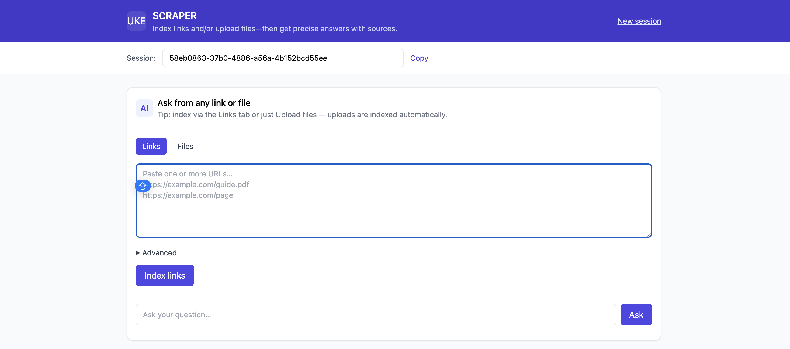
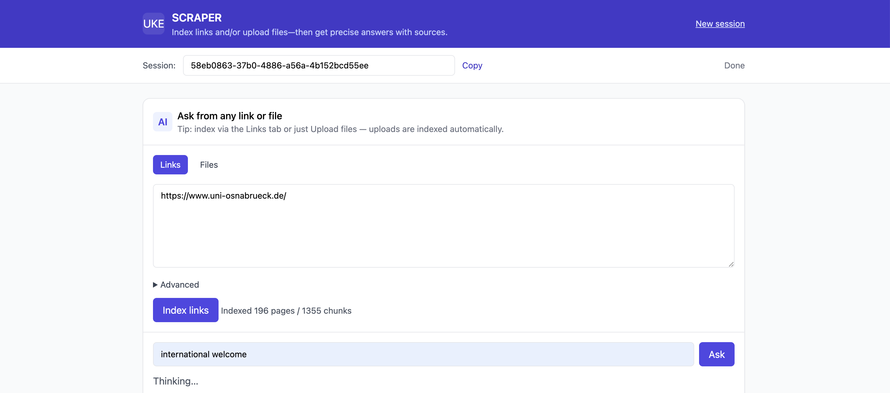
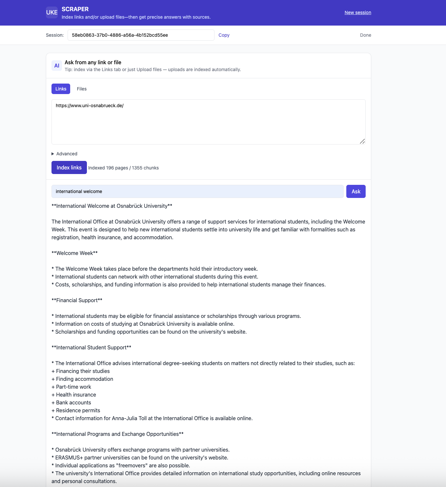

# Site Q&A (Web) — Hybrid RAG with Ollama + Rust (Axum)

**Ask questions from any website link or uploaded file — get accurate, source-backed answers in seconds.**

This is a volunteer project for UKE. It combines a Rust-based Axum backend with a Retrieval-Augmented Generation (RAG) pipeline using Ollama models. The system can crawl websites, extract and embed content (both HTML and optional PDFs), and then answer natural-language questions using a hybrid retrieval approach (semantic + BM25). Both links and files are automatically indexed, and your answers include transparent source links.

---

## ✨ Key Features

- Paste any URL → crawl page + in-scope links (configurable depth & scope)  
- Upload files (PDF, HTML, TXT, MD, DOCX, PPTX…) to index content  
- PDF support via `pdftotext` (Poppler) — optional & speed-limited  
- Embeddings via Ollama (recommend **all-minilm** for speed)  
- Generation via Ollama (default: `llama3.1:8b`)  
- Hybrid retrieval: cosine-embedding similarity + BM25 + keyword boosts  
- Auto-index: If you ask with `start_url`, and no index exists, it will index on the fly  
- Answers include a direct **Source** link and a top-sources list for traceability  
- Speed knobs: skip PDFs, limit PDF pages, reduce chunk sizes, enable fast-mode  




---

## 🖥️ Requirements

- Rust (edition 2021)  
- Ollama running locally  
  - Install: https://ollama.com/download  
  - Start: `ollama serve`  
- Models (pull at least one embed + one LLM):  
  ```bash
  # Embedding model (choose one)
  ollama pull all‐minilm            # fast (recommended)

  # Generation model
  ollama pull llama3.1:8b


# Embedding models (pick one)

```bash
ollama pull all-minilm            # fast (recommended)
```

# Generation model
```bash
ollama pull llama3.1:8b
```

pdftotext (Poppler) for PDF extraction:

macOS (Homebrew): brew install poppler

Linux (Debian/Ubuntu): sudo apt-get install poppler-utils

**Quick start**

```bash
# In the project root
cargo run
# → Open http://127.0.0.1:3000/
```

Paste a site URL at the top (e.g., a university regulations page), click Index, then ask a question (e.g., “What are the uni-assist deadlines?”).

**Recommended fast settings (dev)**

```bash
# Use a small embedding model and faster chunking
export EMBED_MODEL=all-minilm
export FAST_MODE=1            # caps depth/max pages
export SKIP_PDFS=1            # skip PDFs entirely (big speed win)
# or limit PDF pages instead of skipping:
# export PDF_MAX_PAGES=2

# Optional tighter chunk sizes to avoid embed context errors:
export CHUNK_TARGET_CHARS=220
export EMBED_MAX_CHARS=160
export EMBED_NUM_CTX=1024

cargo run
```

**Configuration (env vars)**

| Variable             | Default                  | What it does                                       |
| -------------------- | ------------------------ | -------------------------------------------------- |
| `BIND_ADDR`          | `127.0.0.1:3000`         | HTTP bind address                                  |
| `OLLAMA_HOST`        | `http://localhost:11434` | Ollama server URL                                  |
| `EMBED_MODEL`        | `nomic-embed-text`       | Embedding model name (use `all-minilm` for speed)  |
| `GEN_MODEL`          | `llama3.1:8b`            | LLM for answering                                  |
| `FAST_MODE`          | (unset)                  | If `1`, caps depth/max pages (fast crawl)          |
| `SKIP_PDFS`          | (unset)                  | If `1`, ignores PDFs while crawling                |
| `PDF_MAX_PAGES`      | `12`                     | Max pages extracted per PDF (if not skipped)       |
| `CHUNK_TARGET_CHARS` | `700`                    | Target chunk length before embedding               |
| `EMBED_MAX_CHARS`    | `750`                    | Hard clamp before embedding (avoid context errors) |
| `EMBED_NUM_CTX`      | `2048`                   | Embedding model context (if supported)             |


Tip: You can set these inline when running:
EMBED_MODEL=all-minilm FAST_MODE=1 SKIP_PDFS=1 cargo run

**UI usage**

URL or Files: paste the site you want, or upload files.

Index (optional): manually index content with current settings.

Ask: type your question. If the site isn’t yet indexed, it auto-indexes using the last URL or uploaded files.
The UI shows status messages (indexing → answering), then returns the answer + sources.
**API**
POST /api/index

Index a site manually.

Request 

```bash
{
  "url": "https://example.edu/department/masters",
  "depth": 3,
  "max_pages": 200,
  "scope_prefix": "https://example.edu"   // default = scheme+host
}
```

Response

```bash
{
  "ok": true,
  "chunks": 524,
  "pages_indexed": 71,
  "created_at": "2025-10-17T14:58:47.212539+00:00",
  "source_scope": "https://example.edu"
}
```

POST /api/ask

Ask a question (auto-index if start_url provided).

```bash

{
  "question": "What are the uni-assist deadlines?",
  "start_url": "https://example.edu/admissions/international",
  "depth": 2,
  "max_pages": 120,
  "scope_prefix": "https://example.edu",
  "top_k": 12,
  "temperature": 0.2
}
```

Response
```bash
{
  "answer": "June 15 (Winter Semester) and December 15 (Summer Semester). Source: https://example.edu/…",
  "sources": [
    "https://example.edu/…",
    "https://example.edu/…/regulations.pdf"
  ]
}
```

**How it works (short)**

Crawl the start_url breadth-first to depth, respecting scope_prefix.

HTML → text via scraper. PDFs → text via pdftotext (optional, capped).

Chunk content, then embed with Ollama.

On question: embed the query, then rerank chunks using cosine similarity + BM25 + keyword signals.

Build a grounded prompt with the top chunks → generate final answer with sources.





**Tips & Troubleshooting**

“Failed to create new sequence: input exceeds context length”

Lower chunk sizes:
CHUNK_TARGET_CHARS=220 EMBED_MAX_CHARS=160 EMBED_NUM_CTX=1024

Or use a model with larger context.

Embedding 500 error from Ollama

Ensure ollama serve is running.

Pull the model you set in EMBED_MODEL.

Try EMBED_MODEL=all-minilm.

Indexing is slow

FAST_MODE=1 and SKIP_PDFS=1

Use smaller depth and max_pages (e.g., 2 / 80).

Limit PDFs: PDF_MAX_PAGES=2.

PDF warnings (ligatures/font)

Harmless; pdftotext -q is used to reduce noise.

**Project structure**
.
├── Cargo.toml
├── src/
│   └── main.rs               # Axum server, crawler, RAG, API
└── static/
    └── index.html            # Minimal chat UI


**Notes**

This runs locally; no data leaves your machine except requests to your local Ollama server.

Respect target sites’ robots, rate limits, and terms of use.


